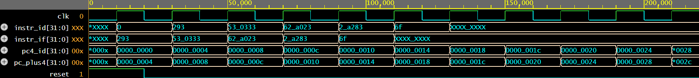
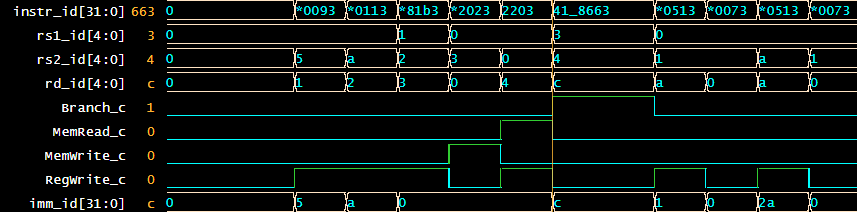
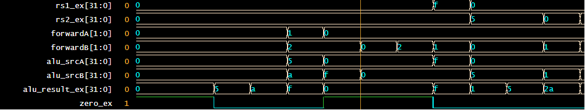
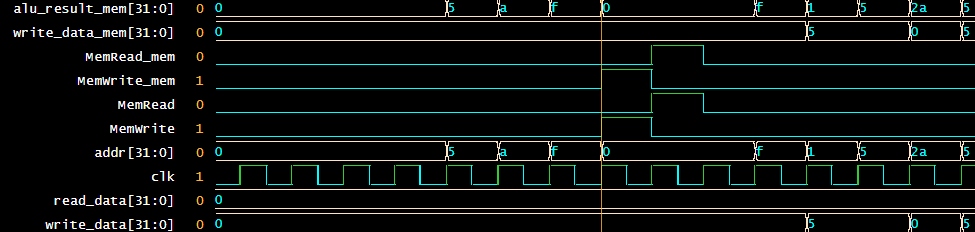
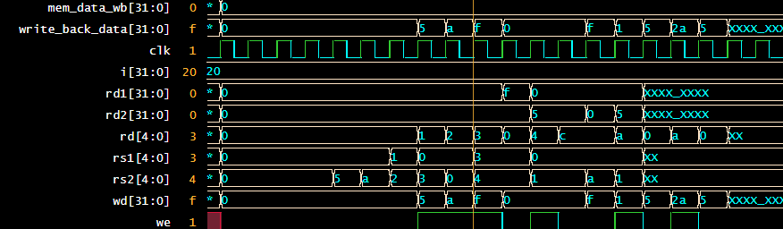

# 5-Stage RV32I Pipelined RISC-V CPU Core  
*A fully synthesizable Verilog implementation of the RV32I ISA with forwarding, hazard detection, and clean modular design.*  

---

## Tech Stack & Skills  

**Languages & HDL**  
[](#)  [](#)  [](#)  

**Architecture & ISA**  
[](#)  [](#)  [](#)  [](#)  

**Tools & Simulation**  
[](#)  [](#)  [](#)  

**License**  
[](LICENSE)  

---

**Tech Stack (Text Version)**: **Verilog** · SystemVerilog Assertions · **Tcl Scripting** · **RISC-V ISA** · Pipeline Design · Hazard Detection · Data Forwarding · Icarus Verilog · GTKWave · EDA Playground  


---
## System Architecture – Hero View  

|  |  
| --- |  
| *Classic 5-stage pipeline with hazard detection and forwarding.* | 

---

## Waveforms – Full Pipeline Execution  

Below: Simulation results showing the pipeline progressing through **IF**, **ID**, **EX**, **MEM**, and **WB** stages.  
Captured directly from **GTKWave** via EDA-Playground.

| **Instruction Fetch (IF)** <br> *Fetches instruction from ROM & updates PC* | **Instruction Decode (ID)** <br> *Decodes opcode, reads registers, generates control signals* | **Execute (EX)** <br> *Performs ALU operations & branch calculations* |
|--------------------------------|--------------------------------------------|--------------------------------------------------------|
|  |  |  |

| **Memory (MEM)** <br> *Accesses data memory for load/store* | **Write Back (WB)** <br> *Writes results back to register file* |
|--------------------------------|--------------------------------|
|  |  |   

---

## 📂 Repository Structure  

```plaintext
riscv-pipeline-cpu/
├── src/ # Verilog source files
│   ├── pc.v # Program Counter
│   ├── instruction_mem.v # Instruction Memory (ROM)
│   ├── data_mem.v # Data Memory (RAM)
│   ├── alu.v # Arithmetic Logic Unit
│   ├── reg_file.v # Register File
│   ├── control_unit.v # Main Control Logic
│   ├── hazard_unit.v # Hazard Detection Unit
│   ├── forwarding_unit.v # Data Forwarding Unit
│   ├── if_id.v # IF/ID Pipeline Register
│   ├── id_ex.v # ID/EX Pipeline Register
│   ├── ex_mem.v # EX/MEM Pipeline Register
│   ├── mem_wb.v # MEM/WB Pipeline Register
│   └── cpu_top.v # Top-Level CPU Integration
│
├── docs/ # Documentation & Media
│   ├── block_diagram.png # 5-Stage Pipeline Block Diagram
│   ├── waveforms/ # GTKWave screenshots
│   │   ├── if_stage.png
│   │   ├── ex_stage.png
│   │   ├── mem_stage.png
│   │   └── wb_stage.png
│   └── README_assets/ # Any extra images or diagrams
│
├── sim/ # Simulation & test programs
│   ├── cpu_tb.v              # Top-Level CPU Testbench
│   ├── cpu_wave.gtkw         # GTKWave configuration
│   ├── dump.vcd              # Simulation dump file
│   ├── id_ex_regs_tb.v       # ID/EX pipeline register testbench
│   ├── immgen_tb.v           # Immediate generator testbench
│   ├── program.hex           # Machine code for simulation
│   ├── program.S             # Assembly source program
│   ├── registerfile_tb.v     # Register file testbench
│   └── testbench.v           # General module testing
│
├── LICENSE # MIT License
└── README.md # Project Overview & Documentation
```

---

## Overview  
This project implements a **classic 5-stage pipelined CPU** for the RISC-V RV32I ISA from the ground up in **Verilog**.  
It demonstrates **Instruction Fetch (IF)**, **Instruction Decode (ID)**, **Execute (EX)**, **Memory Access (MEM)**, and **Write Back (WB)** stages, with **data forwarding** and **hazard detection** for correct execution of dependent instructions.  

The design is **waveform-verified** using GTKWave and runs real RISC-V programs in simulation — no external tools required beyond **EDA-Playground**.  

---

## Pipeline Architecture  

| **Stage** | **Function** |
|-----------|--------------|
| **IF — Instruction Fetch** | Fetch instruction from ROM, update PC, handle jumps/branches |
| **ID — Instruction Decode** | Decode opcode, read registers, generate control signals |
| **EX — Execute** | Perform ALU operations, calculate branch targets, evaluate conditions |
| **MEM — Memory Access** | Load/Store operations from/to data memory |
| **WB — Write Back** | Write ALU or memory results back to registers |


---

## Features  

- **5-Stage Pipeline**: IF → ID → EX → MEM → WB  
- **RV32I Instruction Set**: `ADDI`, `ADD`, `SUB`, `LW`, `SW`, `BEQ`, `JAL`  
- **Hazard Handling**: Data forwarding + stall insertion for load-use hazards  
- **Integrated Instruction ROM**: No external `.hex` required for demos  
- **Waveform-verified**: Captured entirely in **GTKWave** via **EDA-Playground**  

---

## How to Run in EDA-Playground  

1. Open [EDA-Playground](https://edaplayground.com)  
2. Select **Icarus Verilog** + **EPWave**  
3. Paste all Verilog source files + testbench into the left pane  
4. Click **Run** and open **EPWave** to view the pipeline in GTKWave  

---

## Demo Program

The sample program loaded in `program.hex`:

```asm
addi x1, x0, 5
addi x2, x0, 10
add  x3, x1, x2
sw   x3, 0(x0)
lw   x4, 0(x0)
beq  x4, x3, LABEL
jal  x0, 0
LABEL:
addi x5, x0, 42
```
---

## About Me  
Hi! I’m Hyeonji Jung — an Electrical & Computer Engineering student at the University of Toronto passionate about hardware design, embedded systems, and digital logic.  
I love building **from schematic to working system**, blending low-level coding with hardware verification.

[](https://www.linkedin.com/in/hyeonjijung)
[]
